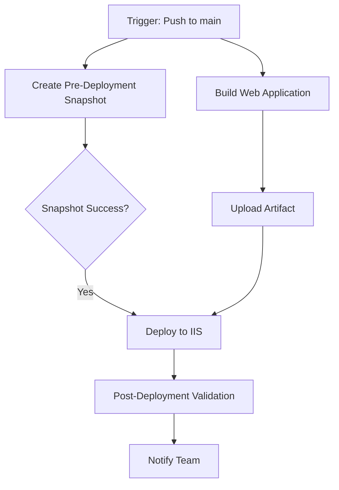

# GitHub Actions Workflow Setup Guide

This guide explains how to set up and use the included GitHub Actions workflow that demonstrates integrating Azure Automation pre-change snapshots into a CI/CD deployment pipeline.

## Overview

The `deploy-iis-webapp.yml` workflow showcases a production-ready deployment pattern for an IIS web application that includes:

1. **Pre-Deployment Snapshot** - Creates VM snapshots before deployment for rollback protection
2. **Build** - Compiles and packages the web application
3. **Deploy** - Deploys to IIS using WebDeploy
4. **Post-Deployment Validation** - Runs smoke tests and health checks

## Workflow Architecture



## Prerequisites

Before using this workflow, you need:

### 1. Azure Automation Setup

- Azure Automation Account with the `Invoke-PreChangeVmSnapshot.ps1` runbook deployed
- Webhook created for the runbook (see instructions below)
- Managed Identity with proper RBAC permissions

### 2. GitHub Repository Secrets

Configure the following secrets in your GitHub repository (Settings → Secrets and variables → Actions):

| Secret Name | Description | Example/Format |
|------------|-------------|----------------|
| `SNAPSHOT_WEBHOOK_URL` | Webhook URL for the snapshot runbook | `https://xxx.webhook.region.azure-automation.net/webhooks?token=xxx` |
| `AZURE_CREDENTIALS` | Service Principal credentials for Azure login | JSON format (see below) |
| `AUTOMATION_RESOURCE_GROUP` | Resource group containing Automation Account | `automation-rg` |
| `AUTOMATION_ACCOUNT_NAME` | Name of your Automation Account | `MyAutomationAccount` |
| `IIS_SERVER` | Target IIS server hostname (optional for demo) | `webserver.contoso.com` |
| `DEPLOY_USERNAME` | WebDeploy username (optional for demo) | `deploy-user` |
| `DEPLOY_PASSWORD` | WebDeploy password (optional for demo) | `<secure-password>` |

### 3. Azure Service Principal

The workflow needs an Azure Service Principal to query job status. Create one:

```bash
# Create service principal
az ad sp create-for-rbac \
    --name "github-actions-snapshot-demo" \
    --role "Automation Job Operator" \
    --scopes /subscriptions/{subscription-id}/resourceGroups/{automation-rg} \
    --sdk-auth

# Output format (save as AZURE_CREDENTIALS secret):
{
  "clientId": "<client-id>",
  "clientSecret": "<client-secret>",
  "subscriptionId": "<subscription-id>",
  "tenantId": "<tenant-id>",
  "activeDirectoryEndpointUrl": "https://login.microsoftonline.com",
  "resourceManagerEndpointUrl": "https://management.azure.com/",
  "activeDirectoryGraphResourceId": "https://graph.windows.net/",
  "sqlManagementEndpointUrl": "https://management.core.windows.net:8443/",
  "galleryEndpointUrl": "https://gallery.azure.com/",
  "managementEndpointUrl": "https://management.core.windows.net/"
}
```

## Step-by-Step Setup

### Step 1: Create the Webhook

```powershell
# Connect to Azure
Connect-AzAccount

# Create webhook for the snapshot runbook
$webhook = New-AzAutomationWebhook `
    -Name "PreChangeSnapshot-GitHub-Actions" `
    -RunbookName "Invoke-PreChangeVmSnapshot" `
    -IsEnabled $true `
    -ExpiryTime (Get-Date).AddYears(1) `
    -AutomationAccountName "MyAutomationAccount" `
    -ResourceGroupName "automation-rg"

# IMPORTANT: Save this URL immediately (it's only shown once)
Write-Host "Webhook URL (save this as SNAPSHOT_WEBHOOK_URL secret):"
Write-Host $webhook.WebhookURI -ForegroundColor Yellow

# Optionally save to secure file
$webhook.WebhookURI | Out-File -FilePath "webhook-url-KEEP-SECRET.txt"
Write-Warning "Store this webhook URL securely - treat it like a password!"
```

**Security Note**: The webhook URL contains an embedded authentication token. Never commit it to source control. Store it in GitHub Secrets.

### Step 2: Configure GitHub Secrets

1. Navigate to your GitHub repository
2. Go to **Settings** → **Secrets and variables** → **Actions**
3. Click **New repository secret**
4. Add each secret from the table above

**Adding SNAPSHOT_WEBHOOK_URL:**
```
Name: SNAPSHOT_WEBHOOK_URL
Value: https://s1events.azure-automation.net/webhooks?token=abc123...
```

**Adding AZURE_CREDENTIALS:**
```
Name: AZURE_CREDENTIALS
Value: <paste the entire JSON output from the service principal creation>
```

### Step 3: Customize the Workflow

Edit `.github/workflows/deploy-iis-webapp.yml` and update these environment variables:

```yaml
env:
  AZURE_WEBAPP_NAME: 'your-webapp-name'      # Change to your app name
  RESOURCE_GROUP: 'your-resource-group'       # Change to your RG
  VM_NAME: 'your-vm-name'                     # Change to your VM name
```

### Step 4: Adjust for Your Application

The workflow includes a fictitious .NET application build. Customize the build steps for your actual application:

**For ASP.NET Core:**
```yaml
- name: Build application
  run: dotnet build ./path/to/your/app.csproj --configuration Release
```

**For Node.js:**
```yaml
- name: Build application
  run: |
    npm ci
    npm run build
```

**For static sites:**
```yaml
- name: Build application
  run: |
    # Copy files or run build tools
    Copy-Item -Path ./src/* -Destination ./publish -Recurse
```

### Step 5: Configure WebDeploy (Optional)

For real WebDeploy deployments, uncomment and configure the MSDeploy command:

```powershell
& "C:\Program Files\IIS\Microsoft Web Deploy V3\msdeploy.exe" `
    -verb:sync `
    -source:contentPath=".\package" `
    -dest:contentPath="Default Web Site/MyApp",`
          computerName="https://${{ secrets.IIS_SERVER }}:8172/msdeploy.axd",`
          username="${{ secrets.DEPLOY_USERNAME }}",`
          password="${{ secrets.DEPLOY_PASSWORD }}",`
          authtype="Basic" `
    -enableRule:AppOffline `
    -allowUntrusted
```

## Using the Workflow

### Trigger via Push

The workflow automatically runs when you push to `main` branch and changes are detected in:
- `src/**` (your application code)
- The workflow file itself

```bash
git add src/
git commit -m "Update application code"
git push origin main
```

### Trigger Manually

You can also trigger the workflow manually with custom parameters:

1. Go to **Actions** tab in GitHub
2. Select **Deploy IIS Web Application with Pre-Change Snapshot**
3. Click **Run workflow**
4. Choose options:
   - **Environment**: `production` or `staging`
   - **Skip snapshot**: Check to skip snapshot creation (not recommended)
5. Click **Run workflow**

### Skip Snapshot (Emergency Deployments)

For emergency hotfixes where snapshot delay is not acceptable:

```yaml
# Manually trigger with skip_snapshot: true
# Or modify the workflow trigger conditions
```

**Warning**: Skipping snapshots removes your rollback safety net. Only do this in emergencies.

## Workflow Behavior

### Job 1: Pre-Deployment Snapshot

1. Generates a unique Change ID: `gh-deploy-{run-number}-{commit-sha}`
2. Calls the Azure Automation webhook with parameters:
   ```json
   {
     "ResourceGroupName": "prod-webapps-rg",
     "VmName": "iis-webserver-01",
     "ChangeId": "gh-deploy-123-abc456",
     "IncludeDataDisks": true,
     "RetentionDays": 14,
     "DryRun": false
   }
   ```
3. Waits for snapshot completion (up to 180 seconds)
4. Optionally verifies job status via Azure API

### Job 2: Build

Runs in parallel with snapshot creation to save time:
1. Checks out code
2. Restores dependencies
3. Builds application
4. Publishes output
5. Uploads artifact

### Job 3: Deploy

Only runs if both snapshot and build succeed:
1. Downloads build artifact
2. Displays deployment information
3. Deploys to IIS using WebDeploy
4. Verifies deployment health
5. Records deployment metadata

### Job 4: Post-Deployment Validation

Runs after successful deployment:
1. Executes smoke tests
2. Validates application health
3. Sends notifications

## Monitoring and Troubleshooting

### View Workflow Execution

1. Navigate to **Actions** tab in GitHub
2. Click on the workflow run
3. Expand each job to see detailed logs

### Common Issues

**Issue**: Webhook invocation fails
```
Solution: Verify SNAPSHOT_WEBHOOK_URL secret is set correctly and webhook hasn't expired
```

**Issue**: Snapshot job times out
```
Solution: Increase maxWaitSeconds in the workflow or check Azure Automation job logs
```

**Issue**: Build fails
```
Solution: Check that your build commands match your actual application structure
```

**Issue**: Azure login fails
```
Solution: Verify AZURE_CREDENTIALS secret is valid JSON and service principal has permissions
```

### Check Azure Automation Job Status

```powershell
# Manually check job status
Get-AzAutomationJob `
    -ResourceGroupName "automation-rg" `
    -AutomationAccountName "MyAutomationAccount" `
    -RunbookName "Invoke-PreChangeVmSnapshot" |
    Sort-Object CreationTime -Descending |
    Select-Object -First 5 |
    Format-Table JobId, Status, CreationTime, EndTime
```

### View Snapshot Job Output

```powershell
# Get job details
$job = Get-AzAutomationJob `
    -Id "job-guid-here" `
    -ResourceGroupName "automation-rg" `
    -AutomationAccountName "MyAutomationAccount"

# View output
Get-AzAutomationJobOutput `
    -Id $job.JobId `
    -ResourceGroupName "automation-rg" `
    -AutomationAccountName "MyAutomationAccount" `
    -Stream Output
```

## Advanced Configuration

### Poll for Actual Job Status

To implement real job status polling instead of fixed wait time, modify the workflow:

```yaml
- name: Wait for Snapshot Completion
  shell: pwsh
  run: |
    $jobId = "${{ steps.invoke-snapshot.outputs.job_id }}"
    $maxAttempts = 20
    $attempt = 0

    while ($attempt -lt $maxAttempts) {
        $job = Get-AzAutomationJob `
            -Id $jobId `
            -ResourceGroupName "${{ secrets.AUTOMATION_RESOURCE_GROUP }}" `
            -AutomationAccountName "${{ secrets.AUTOMATION_ACCOUNT_NAME }}"

        Write-Host "Job Status: $($job.Status)"

        if ($job.Status -eq "Completed") {
            Write-Host "✓ Snapshot completed successfully"
            exit 0
        }

        if ($job.Status -in @("Failed", "Stopped", "Suspended")) {
            Write-Error "✗ Snapshot job failed with status: $($job.Status)"
            exit 1
        }

        Start-Sleep -Seconds 10
        $attempt++
    }

    Write-Error "Timeout waiting for snapshot job"
    exit 1
```

### Add Slack/Teams Notifications

```yaml
- name: Notify Team
  if: always()
  uses: 8398a7/action-slack@v3
  with:
    status: ${{ job.status }}
    text: |
      Deployment ${{ job.status }}
      Change ID: gh-deploy-${{ env.DEPLOYMENT_ID }}
      Snapshot: Created with 14-day retention
    webhook_url: ${{ secrets.SLACK_WEBHOOK }}
```

### Multi-Environment Support

Create separate workflows or use environments:

```yaml
strategy:
  matrix:
    environment: [staging, production]
steps:
  - name: Deploy to ${{ matrix.environment }}
    # deployment steps
```

## Rollback Procedure

If deployment fails and you need to roll back using the snapshot:

1. Navigate to Azure Portal → Snapshots
2. Find snapshot with tag `ChangeId=gh-deploy-{your-change-id}`
3. Follow the rollback procedure in the main README.md

Or automate rollback:

```powershell
# Find the snapshot
$changeId = "gh-deploy-123-abc456"
$snapshot = Get-AzSnapshot -ResourceGroupName "prod-webapps-rg" |
    Where-Object { $_.Tags.ChangeId -eq $changeId -and $_.Tags.SourceDiskRole -eq "OS" }

# Create disk from snapshot and swap (see main README for full procedure)
```

## Security Best Practices

1. **Webhook URL Security**
   - Store in GitHub Secrets only
   - Rotate annually (create new webhook, update secret, delete old webhook)
   - Monitor webhook usage via Azure Automation logs

2. **Service Principal Permissions**
   - Use least-privilege RBAC (Automation Job Operator, not Contributor)
   - Scope to specific resource groups
   - Rotate credentials periodically

3. **Environment Protection**
   - Enable GitHub Environment protection rules for production
   - Require manual approval for production deployments
   - Restrict who can approve deployments

4. **Audit Logging**
   - Enable Azure Automation diagnostic logs
   - Send to Log Analytics workspace
   - Create alerts for failed snapshot jobs

## Cost Considerations

- **Snapshots**: Incremental storage costs (~$0.05/GB/month for standard)
- **Automation Jobs**: Minimal cost for job execution time
- **Retention**: 14-day retention balances safety vs. cost

Estimated monthly cost for 1 VM with 128GB OS disk, daily deployments:
- Snapshot storage: ~$6-8/month
- Automation runtime: ~$0.50/month
- **Total**: <$10/month for automated rollback protection

## Further Reading

- [Azure Automation Webhooks](https://docs.microsoft.com/azure/automation/automation-webhooks)
- [GitHub Actions Documentation](https://docs.github.com/actions)
- [Web Deploy (MSDeploy) Reference](https://docs.microsoft.com/iis/publish/using-web-deploy/introduction-to-web-deploy)
- [Azure RBAC Best Practices](https://docs.microsoft.com/azure/role-based-access-control/best-practices)
